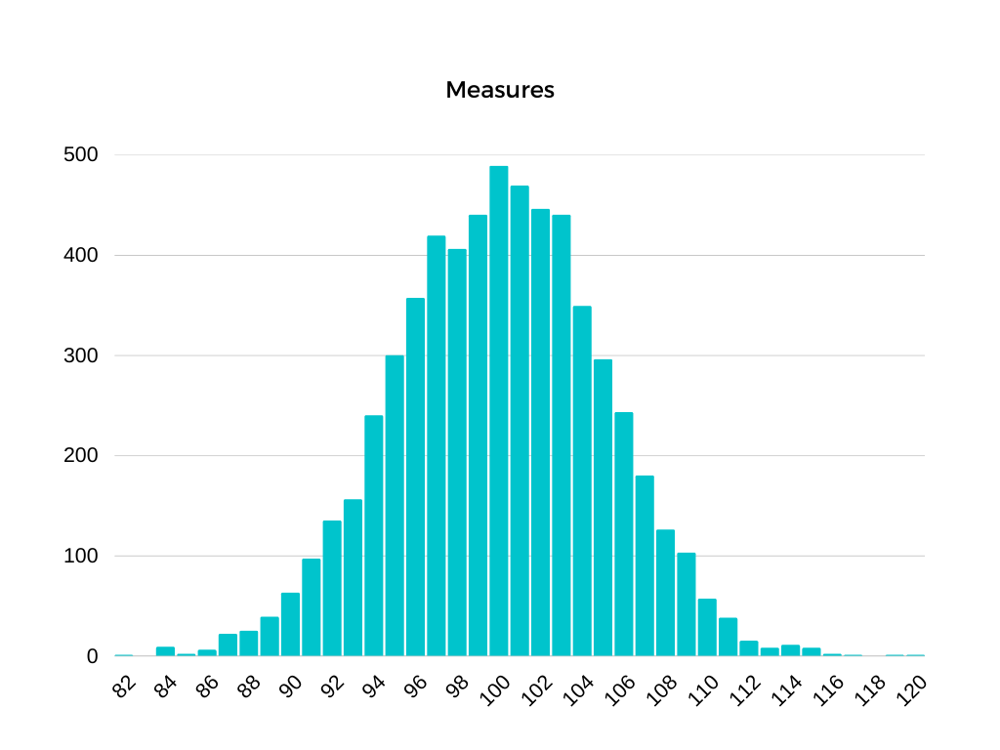
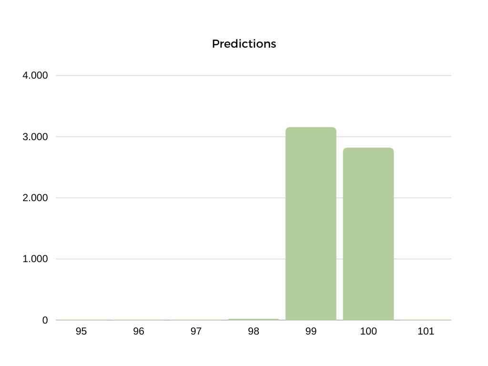

# Kalman Filter for 2-wheeled mobile robots

### Robotic systems course project - 2022/2023


## Introduction

The Kalman filter is a predictive filter based on the model of the behaviour of a system. The aim of predictive filters is to reduce the measurement error on the basis of the knowledge of the system model.

In order to accomplish this goal, the filter firstly performs an estimate of the state variable of the system and compares it with sensor data. The resulting error is then cyclically reduced through a PI controller in which the proportional constant (*Kp*) is updated at each iteration.  

Eventually, the output of the controller is used to correct the prediction.


Our project consists in designing a Kalman filter for our two-wheeled robots, in order to make values from the optical encoders more reliable.

 


## Software

The Kalman Filter need some matrices in order to work:

- X is the state vector; it contains the state variables of the model:

$$
X = \begin{bmatrix}
x_R \\
y_R \\
\theta_R
\end{bmatrix}
$$

- Q is the covariance matrix of the uncertainty of the system; in its main diagonal, there are the variance values of the state variable:

$$
Q = \begin{bmatrix}
\sigma_{x_R}^2 & 0 & 0 \\
0 & \sigma_{y_R}^2 & 0 \\
0 & 0 & \sigma_{\theta_R}^2
\end{bmatrix}
$$

- R is the covariance matrix of the uncertainty of the measure; in its main diagonal, there are the variance values of the state variable:

$$
R = \begin{bmatrix}
\sigma_{x_E}^2 & 0 & 0 \\
0 & \sigma_{y_E}^2 & 0 \\
0 & 0 & \sigma_{\theta_E}^2
\end{bmatrix}
$$

- H is the matrix that specifies the state variables measured (in this case the y component):

$$
H = \begin{bmatrix}
0 & 0 & 0 \\
0 & 1 & 0 \\
0 & 0 & 0
\end{bmatrix}
$$

- P is the covariance error matrix;
- K is the optimal gain (the proportional constant).


------


The complete algorithm is shown as follows:

- ***Prediction***

During the prediction step, we initialized the the state matrix A and the state vector x̂ using the   mathematical models of a two-wheeled robot.
$$
x̂ = A x̂
$$

- ***Update of error covariance***

The error covariance matrix P is determined from the covariance matrix Q.
$$
P = A P A^T + Q
$$

- ***Optimal gain***

Then K is computed such that P is minimal.
$$
K = P H^T (H P H^T + R)^{-1}
$$

- ***Measure correction***

Starting from the updated K and the prediction given by the model, we correct the measure starting from another sensor.
$$
x̂ = x̂ + K (z − H x̂)
$$

- ***Error covariance correction***

$$
P = (I − K H) P
$$


The algorithm is iteratively repeated for all the duration of the sampling.


------


### Matrix.cpp

Since there is no numpy in C++, we decided to implement our own library for handling the matrix operations involved within the Kalman algorithm.


#### Constructor

It is possible to make matrices and vectors of any dimension by just indicating the number of rows, the number of columns and the elements within an array.

```c++
Matrix (unsigned int _num_rows, unsigned int _num_cols, double _matrix[])
            : num_cols{_num_cols}, num_rows{_num_rows}
        {
            matrix = new double*[num_rows];
            for(unsigned short i=0; i<num_rows; i++){
                matrix[i] = new double[num_cols];
                for(unsigned short j=0; j<num_cols; j++)
                {
                    matrix[i][j] = _matrix[j + num_cols*i];
                }
            }
        }
```


#### Transpose

`transpose()` returns a matrix with inverted rows and cols.

```c++
Matrix transpose ()
        {
            double* temp_matrix = new double[num_rows*num_cols];
            unsigned int index = 0;
            for(unsigned short i=0; i<num_rows; i++)
            {
                for(unsigned short j=0; j<num_cols; j++)
                {
                    temp_matrix[index] = this->matrix[j][i];
                    index++;
                }
            }
            return Matrix(num_cols,num_rows,temp_matrix);
        }
```


#### Invert

`invert()` returns an inverted matrix using the Laplace development algorithm.

```c++
Matrix invert ()
{
    // STEP 0 -> check if the matrix is squared
    if(this->num_cols != this->num_rows){
        printf("[Matrix] la matrice non è quadrata, quindi non è invertibile\n");
        return Matrix(0);
    }

    // STEP 1 -> check if the matrix determinant is null
    double det;
    this->determinante(&det);
    if(det == 0){
        printf("[Matrix] il determinante è nullo, quindi non è invertibile\n");
        return Matrix(0);
    }

    // STEP 2 -> if it is not null, the matrix is invertible
    double inverted_matrix[this->num_cols * this->num_rows];
    unsigned int index = 0;

    for(unsigned short i=0; i<num_rows; i++)
    {
        for(unsigned short j=0; j<num_cols; j++)
        {
            inverted_matrix[index] = this->cofattore(i,j);
            index++;
        }
    }

    Matrix M(this->num_cols,this->num_rows,inverted_matrix);
    M = M.transpose();
    return M * (1/det);
}
```


Apart from these, there have been implemented:

- overloading of * operator for matrix product and value-wise product;
- `determinant` method for computing the determinant of square matrices of any order;
- `cofactor` method used recursively with the determinant method;


------


### KalmanOdometry.cpp

The algorithm shown above is implemented within this file in the class `KalmanOdometry` through these methods:

- `prediction()` gathers the first three steps of the algorithm.

It takes two parameters in input: the distance traveled by the left wheel (Δp_left) and the one traveled by the right wheel (Δp_right).


------


#### Prediction

We use these values for calculating the kinematic model of the system (odometry):

***Average of the distance traveled by the wheels (delta_l)***
$$
∆p = \frac{∆p_{left} + ∆p_{right}}{2}
$$
***Relative rotation of the robot (delta_th)***
$$
∆θ = \frac{∆p_{right} − ∆p_{left}}{B}
$$
*where B is the value of the wheelbase.*

***State variables***
$$
x_R = x_R + ∆p \cos{\theta_R} + \frac{∆\theta}{2}
$$

$$
y_R = y_R + ∆p \sin{\theta_R} + \frac{∆\theta}{2}
$$

$$
\theta_R = \theta_R + ∆\theta
$$

This is how it is written in the code:

```c++
double delta_l = (delta_left + delta_right) / 2.0;
double delta_th = (delta_right - delta_left) / this->wheelbase;

double delta_x = delta_l * cos(this->th_r + delta_th / 2.0);
double delta_y = delta_l * sin(this->th_r + delta_th / 2.0);

this->x_r = this->x_r + delta_x;
this->y_r = this->y_r + delta_y;
this->th_r = this->th_r + delta_th;
```


Since Kalman filter is designed to work only with linear systems, we have to linearize ours too; we use the Jacobian, the matrix of all first-order partial derivatives of our state variables:

***before Jacobian***
$$
A = \begin{bmatrix}
x_R & 0 & ∆p\cos{\theta_r+\frac{∆\theta_R}{2}} \\
0 & y_R & ∆p\sin{\theta_r+\frac{∆\theta_R}{2}} \\
0 & 0 & \theta_R + ∆\theta
\end{bmatrix}
$$
***after Jacobian***
$$
A = \begin{bmatrix}
\frac{\partial f_1}{\partial x_R} & \frac{\partial f_1}{\partial y_R} & \frac{\partial f_1}{\partial \theta_R} \\
\frac{\partial f_2}{\partial x_R} & \frac{\partial f_2}{\partial y_R} & \frac{\partial f_2}{\partial \theta_R} \\
\frac{\partial f_3}{\partial x_R} & \frac{\partial f_3}{\partial y_R} & \frac{\partial f_3}{\partial \theta_R}
\end{bmatrix} = \begin{bmatrix}
1 & 0 & -∆p\sin{\theta_r+\frac{∆\theta_R}{2}} \\
0 & 1 & ∆p\cos{\theta_r+\frac{∆\theta_R}{2}} \\
0 & 0 & 1
\end{bmatrix}
$$
Here is how it is written in code:

```c++
double a[] = {1.0, 0.0, -delta_y,
              0.0, 1.0, delta_x,
              0.0, 0.0, 1};
Matrix* A = new Matrix(3,3,a);
```


Then, we define the state vector (X):

```c++
double _x[] = {this->x_r, this->y_r, this->th_r};
        // already transposed
        X = new Matrix(3,1,_x);
```


and update the covariance error matrix and the gain:

```c++
// update of the covariance error matrix
(*P) = (*A) * (*P) * (A->transpose()) + (*Q);

Matrix *S = new Matrix(0);
// update of the optimal gain
(*S) = (*H) * (*P) * (H->transpose()) + (*R);
(*K) = ((*P) * (H->transpose())) * (S->invert());
```


------

- `measure()` takes a matrix with the collected measure from an hypothetic ToF sensor (Time of Flight) .


#### Measure

Here is the step where we correct the measurement error:

```c++
(*X) = (*X) + (*K) * ((*Measure) - (*H) * (*X));
this->x_r = X->getMatrix()[0][0];
this->y_r = X->getMatrix()[1][0];
this->th_r = X->getMatrix()[2][0];
```


------

- `update()`updates the value of the covariance error matrix.


#### Update

```c++
Matrix* Identity = new Matrix(this->order);
(*P) = ((*Identity) - (*K) * (*H)) * (*P);
```


------


### Results of the simulation

We conducted a first simulation of the filter using random Gaussian variables generated by a C++ standard library object as the output of the ToF sensor.

We put the variables iteratively within the algorithm and the primary results were quite encouraging:

```c++
// from main.cpp
while(t < 150000)
{
    double delta_l = 79.6;
    double delta_r = 79.6005;

    if(t > 500)
    {
        delta_l = 0;
        delta_r = 0;
    }

    ko->prediction(delta_l, delta_r);

    double _measure = 100.0 + std::round(d(gen));
    ++hist_measure[_measure];
    // printf("[Main] Normal random: %f\n", _measure);

    _measures[1] = _measure;

    // già trasposta
    Measures = new Matrix(3,1,_measures);

    ko->measure(Measures);
    ko->update();

    ++hist_prediction[ko->y_r];

    // printf("[Main] x %f, y %f\n", ko->x_r, ko->y_r);
    t = t + delta_t;
    i++;
}
```

We simulate the movement of the wheels of the robot for the first 5 seconds; then it stops.

`prediction()`, `measure()` and `update()` are called in the while loop simulating a sampling from the encoders lasting 15 seconds.

In `_measure` the value from the ToF sensor is constantly updated with a random Gaussian value given by `std::round(d(gen))`.


##### This is the histogram of the measures collected during the simulation (for the y component):



It is clear how they describe the behaviour of a normal distribution.

##### And then the histogram of the predicted values (for the y component):



The filter was able to reduce the noise coming from the encoders!


## Case study

to continue...
